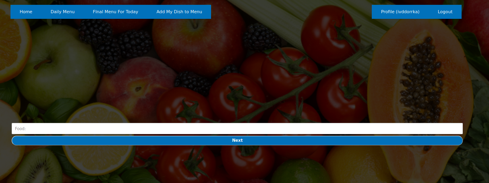

# Nutrition Assistant
> Design healthy and varied diet perfectly for you! 

Designing healthy and balanced diet requires a lot of knowledge, research and time in order to  calculate appropriate amount of necessary *nutrients* without forgetting to consume all of them daily. What's more, you should appreciate what you are eating, have varied dishes that suits you perfectly. We are here to make this task easier for you!

This project will be created to help people **calculate a proper amount of nutrient** he/she will need to consume during the week according to some personal information the user will have to provide us with. These would include some personal measurements such as *height, weight, etc.* and some additional information based on what he/she eats or does not eat.

## Table of content
* [What it is going to look like?](#what-it-is-going-to-look-like%3F)
* [Installation](#installation)
* [Usage](#usage)
* [Credits](#credits)
* [License](#license)

## What it is going to look like?
This will be a web app having a few pages, where user will be able to registrate, enter his/her measurements afterwards and get a menu for the week with a possibility to change some food by another. 

Read **[wiki page](https://github.com/ivddorrka/OP_nutriotionproject/wiki/Idea-of-project)** to learn more!

## Installation

## Usage
 

First of all login or registrate

As soon as you do it - you'll be able to use other features we provide you with 
* At the home page - there's always data concerning how much should you eat

There're several buttons at the topbar 
* First of all you can modify your personal data - "Profile" 

* Secondly you will be able to generate a menu for today - be careful if you want to save it - you shoud choose "None" and then click "change" button 

You may also add as much extra products as you wish to calculate how much nutrients will be added to the menu you've accepted 

All you need to do - is search for a particular product, write down its weight and press the enter key. The nutrients will be automatically added to the final calculationg/ which can be fiund tougether with your final menu:

## Credits
* Darya Kuzmina
* Alina Muliak
* Hlib Solodzhuk
* Andrii Zabulskyi
* Yaroslav Moskalyk

## License
[MIT](LICENSE)
